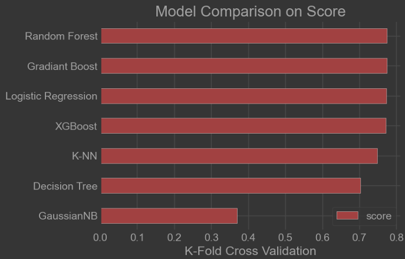
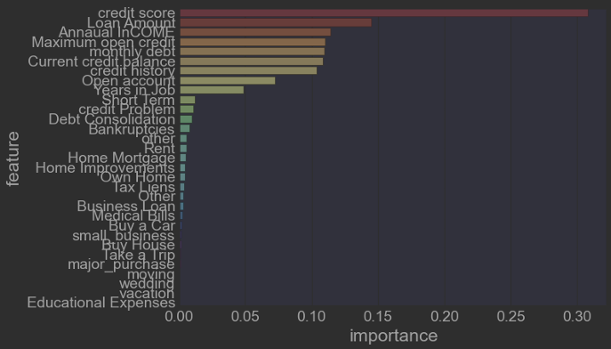

# Bank Loan Status Analysis Using Data Mining Techniques

This project applies data mining and machine learning techniques to analyze and predict the loan approval status of bank customers. It includes preprocessing, model training, evaluation, and comparison of different classifiers.

## 📊 Project Highlights

- Dataset: [Kaggle Dataset - Bank Loan Dataset](https://www.kaggle.com/datasets/zaurbegiev/my-dataset)
- Models Used: Logistic Regression, KNN, Naive Bayes, Decision Tree, Random Forest, XGBoost
- Libraries: pandas, numpy, matplotlib, seaborn, scikit-learn, xgboost

## 📁 Project Structure

```
project_root/
├── data/
├── models/
├── utils/
├── main.py
├── train.py
├── evaluate.py
├── requirements.txt
└── README.md
```

## 🧪 How to Run

```bash
python -m venv venv
source venv/bin/activate  # On Windows: venv\Scripts\activate
pip install -r requirements.txt
python main.py
```

## 🔍 Results and Visualizations

Below are examples of evaluation results and visualizations:

### Model Comparison on Score


### Feature Importance



## 📬 Author
Developed as part of a Capstone Project for academic submission.

---
